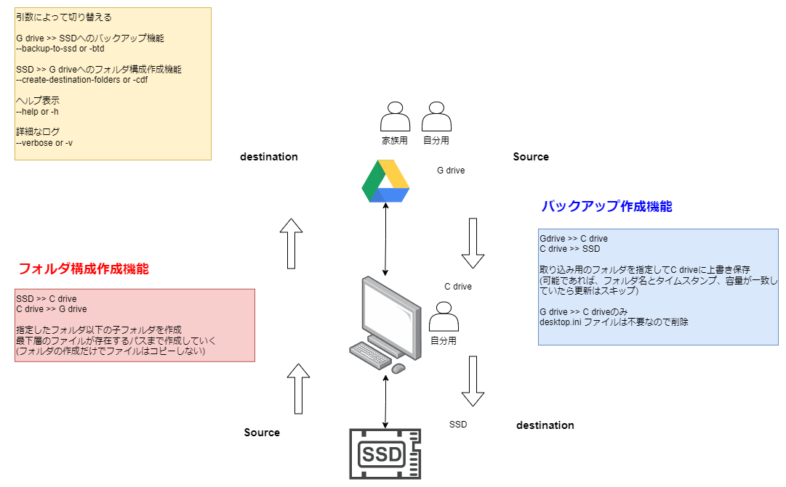

# folder-sync-rs

## 概要

* Windows(Cドライブ),Gドライブ,外付けSSDのフォルダをそれぞれ同期を図る
* リアルタイムではなく実行した段階で同期



## 機能一覧

### フォルダ構成作成機能

* 指定したフォルダ以下の階層レベルを作成
* 最下層のファイルが存在するパスまで作成していく
(フォルダの作成だけでファイルはコピーしない)

### バックアップ作成機能

* 取り込み用のフォルダを指定して上書き保存
* フォルダ名とタイムスタンプ、容量が一致していたら更新はスキップ
* .gdoc、.gsheet、.gslidesなどのGoogleショートカットファイルはスキップする

## コマンドライン引数

### フォルダ構成作成機能

-cdf or --create-destination-folders

```shell
folder-sync-rs.exe -cdf
```

### バックアップ作成機能

-bts or --backup-to-ssd

```shell
folder-sync-rs.exe -bts
```

### 設定ファイル指定機能

`-f` or `--file`

デフォルトのconfig.jsonではなく、別の設定ファイルを指定して実行できます。

```shell
folder-sync-rs.exe -f my-config.json -bts
```

## 設定ファイル

`config.json`ファイルにそれぞれ必要な項目を追記していく
| 項目(キー) | 項目名称 | 項目(値)入力例 | 項目(値)の型 | 説明 |
|---|---|---|---|---|
| bts | バックアップモードでの設定情報 |  | dist | GドライブからCドライブへ、CドライブからSSDへのバックアップモードで使用 |
| - source | バックアップ元のパスを指定 | G:\マイドライブ\MyWork | str | GドライブやCドライブのパスを指定 |
| - destination | バックアップ先のパスを指定 | C:\Users\<user>\Desktop\MyWork | str | CドライブやSSDのパスを指定 |
| - overwrite | 上書き保存するかどうか | true | bool | 同じファイルがあった時に上書きするかどうか true >> 上書きする |
| - exclude | 除外するファイルやフォルダ |  | list[str] |  |
| cdf | フォルダ構成作成モードでの設定情報 |  | dist | SSDからCドライブへ、CドライブからGドライブへのフォルダ構成作成モードで使用 |
| - source | フォルダ構成の展開元のパスを指定 | C:\Users\<user>\Desktop\MyWork | str | CドライブやSSDのパスを指定 |
| - destination | フォルダ構成の展開先のパスを指定 | G:\マイドライブ\MyWork | str | GドライブやCドライブのパスを指定 |

## 使用方法

1. `folder-sync-rs.exe`と同じ階層で、以下の2つの設定ファイルを配置する
    * `config.json`
    * `log4rs.yaml` 
2. `config.json` に必要なパラメータを記入する
3. ターミナルより `-bts` or `-cdf` のどちらかの引数を渡して実行

## 実行環境
* Windows11

## コンパイル

```
cargo build --release
```
